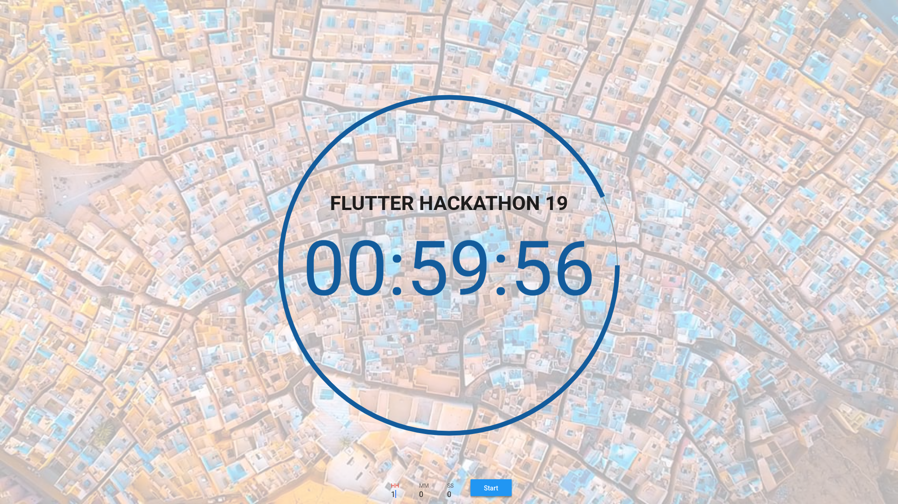
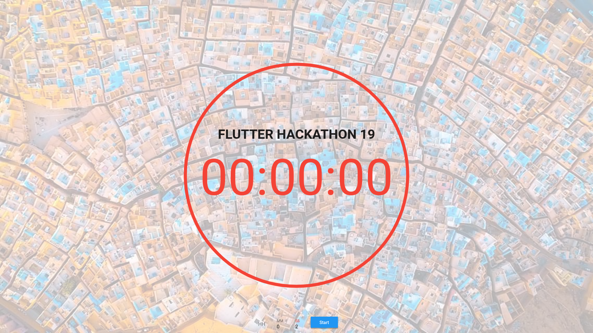

# Flutter Web - Hack19

## Flutter Web CountDown App

----------

### Description
Web app developed using Flutter for web in order to be used during the
International Flutter Hackathon 2019 held in Google Developers Group chapter of Ghardaia - Algeria
> Made by : Elbez Hammouda & Abdelhak Ketmi (GDG Constantine)

### Getting Started
1. Setup Flutter ( [check here ](https://flutter.io/get-started/install/))

3. Setup [Flutter for web](https://github.com/flutter/flutter_web)

2. Download this source code.

3. Enjoy !!

### Resources
For help getting started with Flutter, you can check those resources
- [Official documentation](https://flutter.io/).

- [Start Flutter](https://startflutter.com/).

- [Flutter at Gitter](https://gitter.im/flutter/flutter).

- [Flutter packages](https://pub.dartlang.org/flutter).
  
- [Flutter for Web](https://github.com/flutter/flutter_web)

- [Awesome Flutter github repo](https://github.com/Solido/awesome-flutter).

